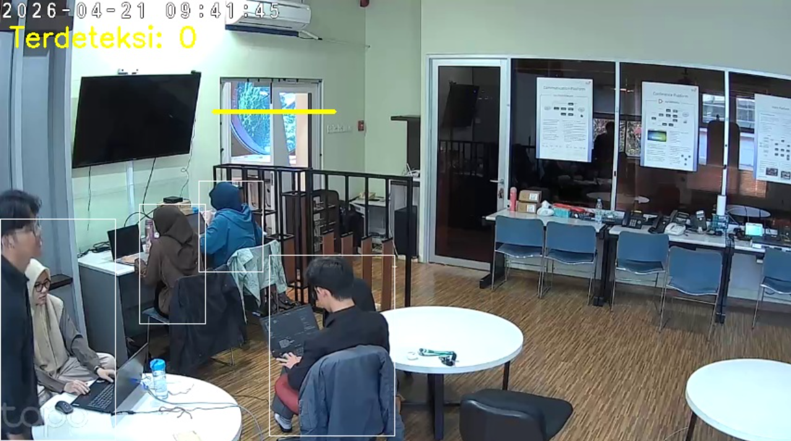
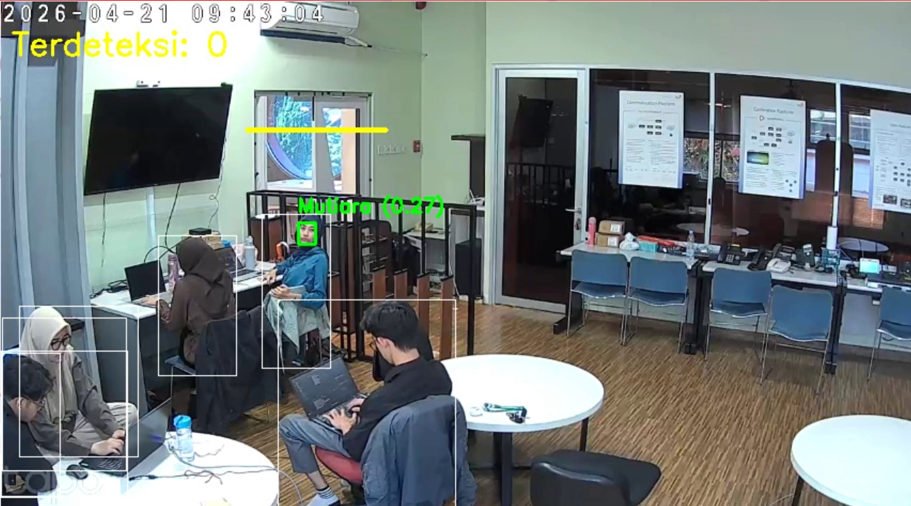
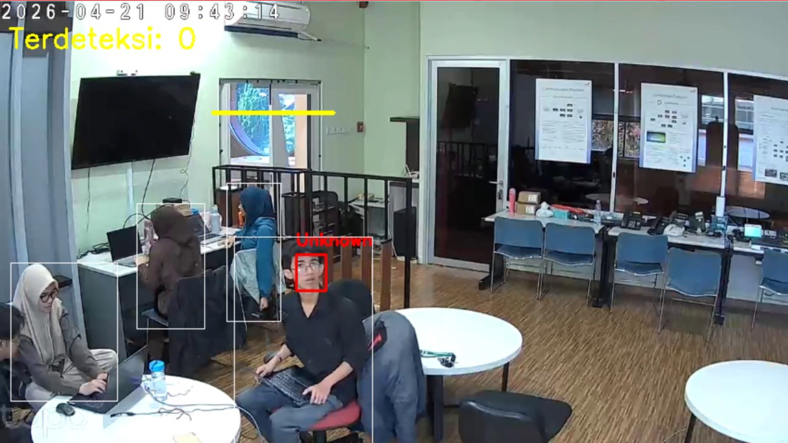

# 🎥 Video Analytics Edge

> Real-time video analytics system with face recognition, line crossing detection, and people counting for security surveillance — built on an edge computing approach.


---

## 📌 Overview

This project is developed as part of an internship at **ISR Lab (Infra Service Research), PT. Telkom Indonesia**, exploring the concept of **edge computing** applied to real-time video analytics.

Instead of sending raw video streams to a central cloud server, all processing — object detection, face recognition, and behavioral analysis — is performed **directly on the edge device**, reducing latency and bandwidth usage.

---

## ✨ Features

| Feature | Description |
|---|---|
| 👤 **Face Recognition** | Identifies registered individuals from live CCTV stream using InsightFace embeddings |
| 🚶 **People Detection** | Detects people in real-time using YOLOv8 object detection |
| 🚧 **Line Crossing Detection** | Detects when a person crosses a defined boundary line, counting entry and exit events |
| 🔴 **Anomaly Reporting** | Automatically reports unknown faces and crossing events to a backend server |
| 📹 **Clip Recording** | Saves 10-second video clips triggered by detection events |
| 🔁 **Auto Reconnect** | Automatically reconnects to the camera stream if the connection drops |
| 📡 **MJPEG Live Stream** | Streams processed video via browser-accessible MJPEG endpoint |

---

## 🏗️ System Architecture

```
CCTV Camera
     │
     ▼
Edge Device (this repo)
├── YOLOv8          → People Detection
├── InsightFace     → Face Recognition
├── Line Crossing   → Entry/Exit Counting
├── Flask Server    → MJPEG Stream + REST API
└── Frame Buffer    → Clip Recording
     │
     ▼
Node.js Backend Server
├── Anomaly Reporting
├── Clip Notification
└── Dashboard (separate repo)
```

---

## 🛠️ Tech Stack

- **[YOLOv8](https://github.com/ultralytics/ultralytics)** — Real-time object detection
- **[InsightFace](https://github.com/deepinsight/insightface)** — Face analysis & recognition
- **[Flask](https://flask.palletsprojects.com/)** — Web server & MJPEG streaming
- **[OpenCV](https://opencv.org/)** — Video processing
- **[FFmpeg](https://ffmpeg.org/)** — Video conversion & optimization
- **Python 3.10+**

---

## 📁 Project Structure

```
video-analytics-edge/
├── videoanalytics.py     # Main application — detection, recognition, streaming
├── register_face.py      # Script to register new faces into the dataset
├── requirements.txt      # Python dependencies
├── Dockerfile            # Docker image for edge deployment
├── py.env.example        # Environment variable template
├── templates/
│   └── indexx.html       # Web UI for live stream
└── static/
    ├── style.css
    └── script.js
```

---

## ⚙️ Installation

### 1. Clone the repository
```bash
git clone https://github.com/mutiarapy/video-analytics-edge.git
cd video-analytics-edge
```

### 2. Create virtual environment
```bash
python -m venv venv
source venv/bin/activate  # Linux/Mac
```

### 3. Install dependencies
```bash
pip install -r requirements.txt
```

### 4. Install FFmpeg
```bash
sudo apt update && sudo apt install ffmpeg -y
```

### 5. Download YOLOv8 model
```bash
# Model will auto-download on first run, or manually:
wget https://github.com/ultralytics/assets/releases/download/v0.0.0/yolov8n.pt
```

### 6. Set up environment variables
```bash
cp py.env.example py.env
nano py.env   # Fill in your values
```

### 7. Register faces
```bash
python register_face.py
```

### 8. Run the application
```bash
python videoanalytics.py
```

Access the live stream at: `http://localhost:5000`

---

## 🐳 Docker Deployment

```bash
docker build -t video-analytics-edge .
docker run -p 5000:5000 --env-file py.env video-analytics-edge
```

---

## 🔧 Environment Variables

Copy `py.env.example` to `py.env` and fill in the values:

```env
# URL of the CCTV camera stream
STREAM_URL=http://YOUR_CAMERA_IP:PORT/api/stream.mp4?src=stream_name

# URL of this Python server (Flask)
PYTHON_SERVER_URL=http://localhost:5000

# URL of the Node.js backend server
SERVER_URL=http://localhost:3000

# Directory paths for saving recordings and clips
SAVE_DIR=/path/to/recordings
CLIPS_DIR=/path/to/clips
```

---

## 🧠 How It Works

### Face Recognition
1. Frames are captured from the CCTV stream every 5 frames
2. InsightFace detects and extracts face embeddings
3. Embeddings are compared against the registered dataset (`dataset_wajah.pkl`) using cosine similarity
4. If similarity > 0.2 → identified; otherwise → reported as **Unknown**

### Line Crossing Detection
1. A virtual boundary line is defined by two coordinates
2. Each detected person is tracked using centroid matching across frames
3. When a person's bounding box crosses the line, the direction (entry/exit) is determined by vertical movement
4. Events are reported to the backend and a clip is saved

### Clip Recording
- A rolling frame buffer (150 frames ≈ 10 seconds) is maintained in memory
- When a detection event is triggered, the last 10 seconds are saved as a `.mp4` clip
- Clips are converted with FFmpeg for browser compatibility

---

## 📡 API Endpoints

| Method | Endpoint | Description |
|---|---|---|
| GET | `/` | Web UI with live stream |
| GET | `/video_feed` | MJPEG live stream |
| GET | `/clips/<filename>` | Serve a specific clip |
| GET | `/list-clips` | List all saved clips |
| GET | `/recordings` | List all recordings |
| GET | `/recordings/<filename>` | Serve a specific recording |

---

## 📸 Screenshots





---

## 🤝 Related Repository

This project works together with the **Node.js backend** (separate repository) that handles:
- Anomaly & detection logging
- Clip notification
- Dashboard UI

---

## 👩‍💻 Author

**Mutiara PY** — Internship at ISR Lab, PT. Telkom Indonesia

---

## 📚 References

- [Ultralytics YOLOv8 Documentation](https://docs.ultralytics.com/)
- [InsightFace GitHub](https://github.com/deepinsight/insightface)
- [Flask Documentation](https://flask.palletsprojects.com/)
- [Edge Computing — IEEE](https://ieeexplore.ieee.org/document/7488250)